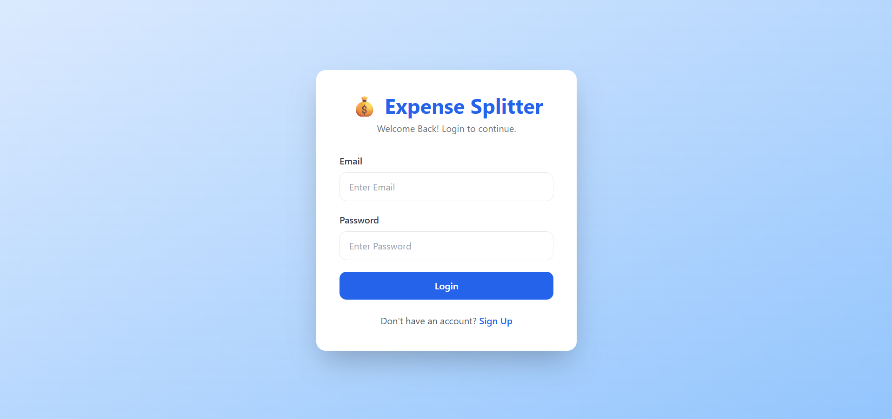
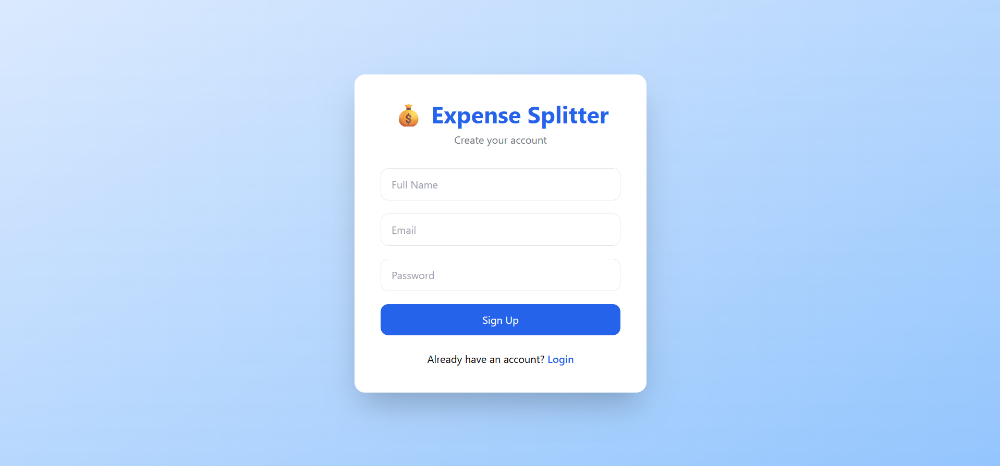
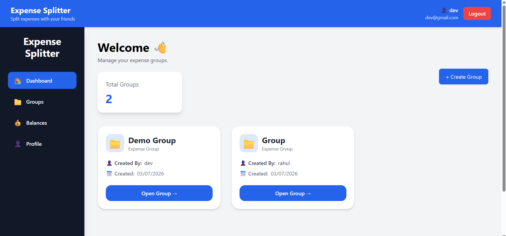
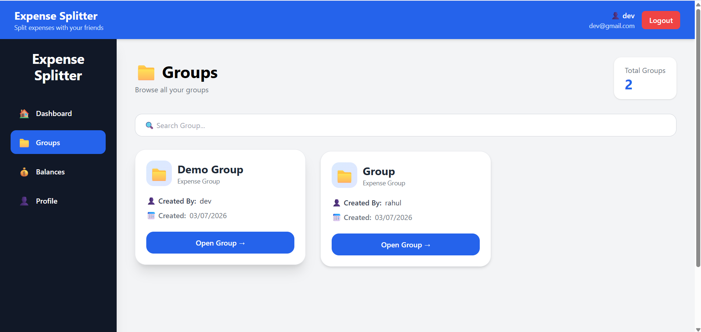
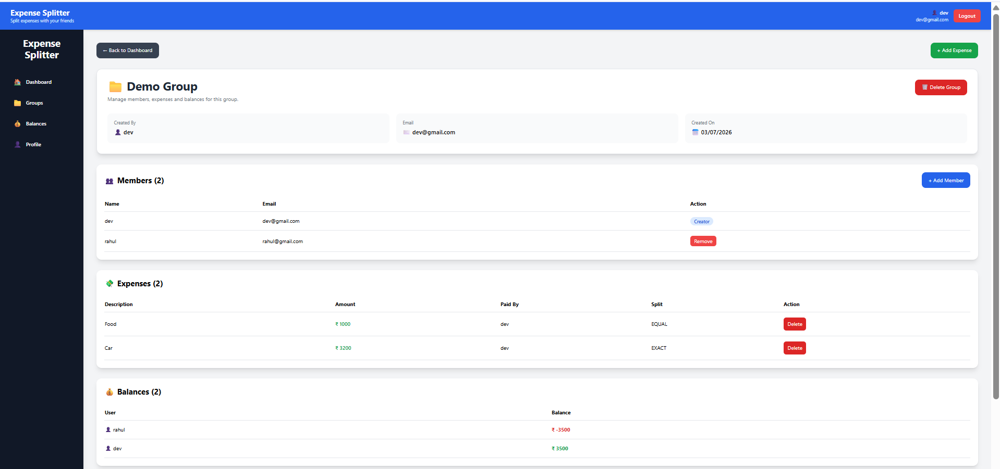
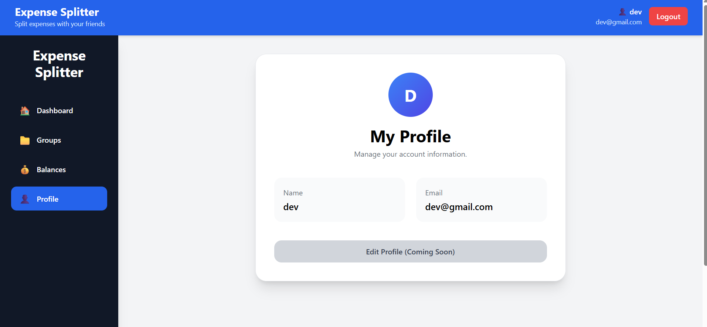

# 💸 Expense Splitter Frontend


A modern and responsive frontend for the **Expense Splitter** application. Built with **React**, **Vite**, and **Tailwind CSS**, it provides a clean interface for managing shared expenses, groups, balances, and settlements.

---

# 🌐 Live Demo

Frontend

https://expense-splitter-frontend-ochre.vercel.app/

Backend API

https://expense-splitter-backend-eb7u.onrender.com/

---

# ✨ Features

## 🔐 Authentication

- User Signup
- User Login
- JWT Authentication
- Automatic Token Handling
- Protected Routes

---

## 📊 Dashboard

- Welcome Dashboard
- Total Groups Card
- Create Group
- Responsive Layout

---

## 👥 Group Management

- View Groups
- Search Groups
- Open Group Details
- Delete Group

---

## 💸 Expense Management

- Add Expense
- Equal Split
- Exact Split
- Delete Expense
- Real-time Updates

---

## 👤 Member Management

- Add Member
- Remove Member
- Creator Permissions

---

## 💰 Balance Management

- View Group Balances
- Personal Balance Summary
- Settlement Suggestions

---

## 📱 Responsive Design

- Desktop
- Laptop
- Tablet
- Mobile
- Responsive Sidebar
- Mobile Navigation
- Responsive Modals

---

# 🛠 Tech Stack

- React
- Vite
- Tailwind CSS
- Axios
- React Router DOM
- React Toastify
- Lucide React

---

# 📂 Folder Structure

```
src
│
├── components
├── pages
├── services
├── assets
├── App.jsx
└── main.jsx
```

---

# 🎨 UI Highlights

- Modern Dashboard
- Responsive Sidebar
- Mobile Navigation
- Responsive Tables
- Responsive Modals
- Clean Card Design
- Toast Notifications
- Loading Indicators

---

# ⚙ Running Locally

Clone repository

```bash
git clone https://github.com/DevbBhatt/expense-splitter-frontend.git
```

Move into project

```bash
cd expense-splitter-frontend
```

Install dependencies

```bash
npm install
```

Run development server

```bash
npm run dev
```

---

# 🔑 Environment Variables

Create a `.env` file:

```env
VITE_API_URL=https://expense-splitter-backend-eb7u.onrender.com
```

---

# 🌐 Deployment

| Service | Platform |
|----------|----------|
| Frontend | Vercel |
| Backend | Render |
| Database | TiDB Cloud |

---
# 📸 Screenshots

## Login



---

## Sign Up



---

## Dashboard



---

## Groups



---

## Group Details



---

## Profile



# 🚀 Future Improvements

- Dark Mode
- User Profile Editing
- Expense Categories
- Charts & Analytics
- Multi Currency Support
- Notifications
- Offline Support
- PWA Support

---

# 👨‍💻 Author

**Dev Bhatt**

GitHub

https://github.com/DevbBhatt

LinkedIn

https://www.linkedin.com/in/dev-bhatt-9825b12bb/

---

## ⭐ If you like this project, consider giving it a star!